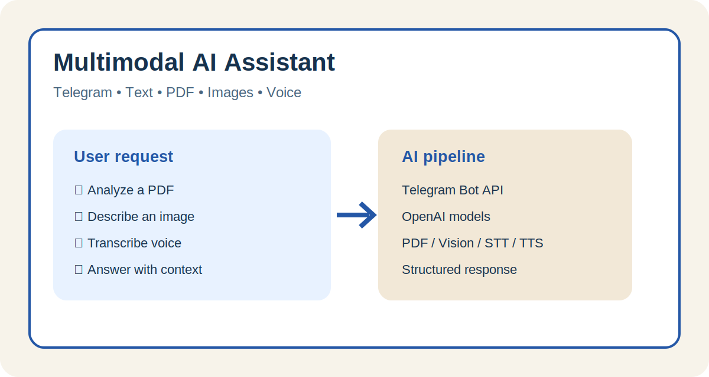
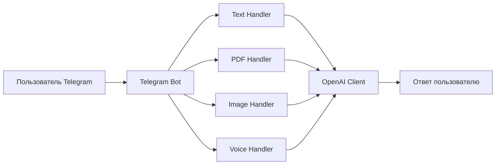

# 🤖 Мультимодальный AI-ассистент

<p align="center">
  
</p>

Telegram-бот для работы с текстом, PDF-документами, изображениями и голосовыми сообщениями. Проект демонстрирует интеграцию нескольких AI-моделей в единый пользовательский сценарий.

## 🎯 Задача проекта

Создать универсального ассистента, который принимает контент разных типов, определяет нужный способ обработки и возвращает понятный текстовый или голосовой ответ.

## ✨ Функциональные блоки

- **Текстовый диалог** — ответы на вопросы и поддержка контекста.
- **PDF-анализ** — извлечение текста, анализ документа и подготовка структурированного отчёта.
- **Компьютерное зрение** — описание и анализ изображений.
- **Генерация изображений** — команда `/generate <описание>`.
- **Speech-to-Text** — распознавание голосовых сообщений.
- **Text-to-Speech** — создание голосового ответа.
- **Логирование** — запись событий и ошибок в консоль и `bot.log`.

## 🛠 Стек технологий

| Направление | Технологии |
|---|---|
| Язык | Python 3.10+ |
| Telegram | pyTelegramBotAPI |
| LLM и Vision | OpenAI API, GPT-4o-mini |
| Голос | Whisper, TTS |
| Изображения | DALL·E |
| PDF | PyPDF2 |
| Конфигурация | python-dotenv, Pydantic |

## 🧩 Архитектура



## 📁 Структура проекта

```text
multimodal_assistant/
├── handlers/
│   ├── pdf_handler.py
│   ├── image_handler.py
│   ├── text_handler.py
│   └── voice_handler.py
├── utils/
│   ├── file_utils.py
│   └── prompts.py
├── config.py
├── openai_client.py
├── main.py
├── .env.example
├── requirements.txt
└── README.md
```

## 🖼 Демонстрация

Изображение выше показывает основные пользовательские сценарии и AI-конвейер проекта. Для портфолио можно дополнительно добавить реальные скриншоты переписки в папку `docs/screenshots/`.

## 🚀 Запуск

### 1. Клонировать репозиторий

```bash
git clone https://github.com/dimitry8st-prog/PEM_04-multimodal_assistant.git
cd PEM_04-multimodal_assistant
```

### 2. Создать виртуальное окружение

```bash
python -m venv .venv
```

Windows:

```bash
.venv\Scripts\activate
```

Linux/macOS:

```bash
source .venv/bin/activate
```

### 3. Установить зависимости

```bash
pip install -r requirements.txt
```

### 4. Настроить переменные окружения

```bash
cp .env.example .env
```

Заполнить `.env`:

```env
OPENAI_API_KEY=your_openai_api_key
TELEGRAM_BOT_TOKEN=your_telegram_bot_token
```

### 5. Запустить

```bash
python main.py
```

## 🔐 Безопасность

- Не публикуйте реальные API-ключи.
- Храните `.env` в `.gitignore`.
- Для production используйте отдельного Telegram-бота и ограничения расходов API.

## 📌 Статус

Учебный портфолио-проект. Возможные улучшения: база данных для истории, лимиты пользователей, Docker, тесты и панель администратора.
